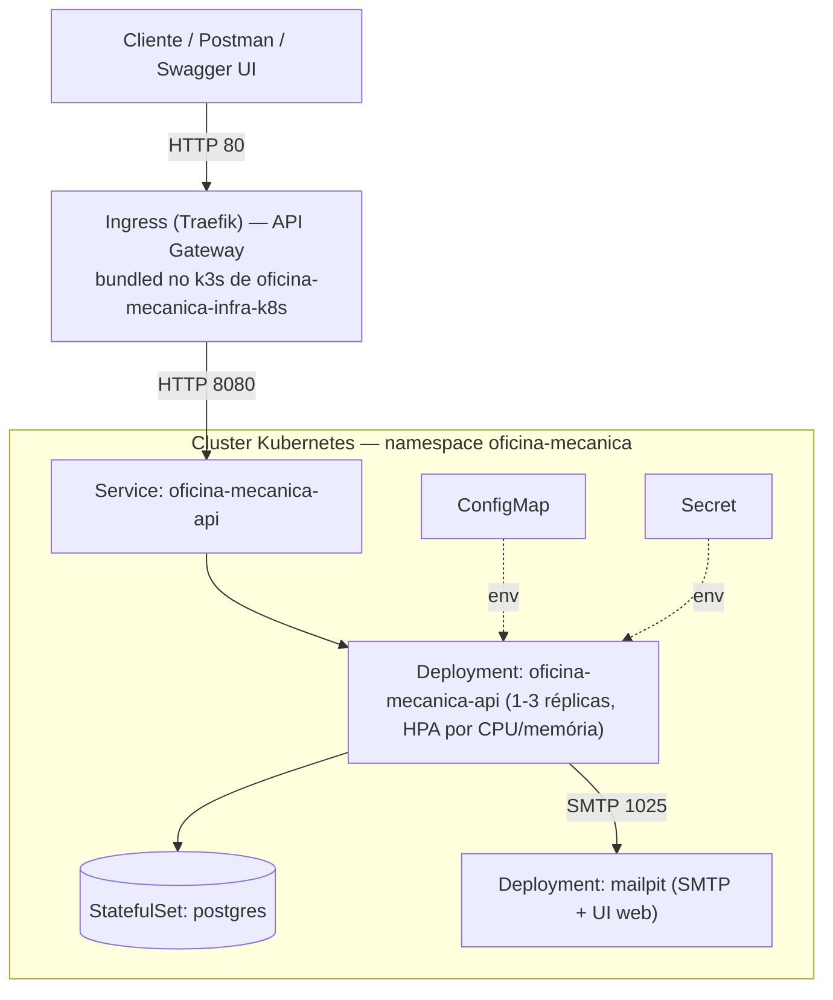
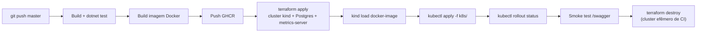

# 🔧 Oficina Mecânica - Sistema Integrado de Atendimento e Execução de Serviços

## Objetivo 

Back-end de uma oficina mecânica de médio porte, focado em **gestão de ordens de serviço, clientes, veículos, serviços e peças**, aplicando **Domain-Driven Design (DDD)** com boas práticas de qualidade de software e segurança.

### Fase 2 — Evolução para produção

A Fase 2 evolui a aplicação da Fase 1 para suportar operação em escala, com foco em:
- Fechar lacunas de negócio nas APIs de OS (listagem priorizada por status, notificação de mudança de status por e-mail, endpoints de acompanhamento/aprovação públicos para o cliente final);
- Conteinerização revisada (Docker + docker-compose com Mailpit para e-mail local);
- Orquestração com **Kubernetes** (Deployment, Service, ConfigMap, Secret, HPA);
- Provisionamento de infraestrutura como código com **Terraform** (cluster + banco de dados);
- Pipeline de **CI/CD** completo (build, testes, imagem Docker, deploy no cluster).

## Tecnologias

| Tecnologia | Justificativa |
|---|---|
| **.NET 8** | LTS, alta performance, ecossistema maduro para APIs RESTful |
| **PostgreSQL 16** | Banco relacional robusto, open-source, excelente para dados transacionais de ordens de serviço, controle de estoque e relacionamentos entre clientes/veículos. Escolhido por ser gratuito, ter ótimo suporte a JSON e consultas complexas |
| **Entity Framework Core 8** | ORM produtivo com suporte a migrations e mapeamento rico do domínio |
| **JWT (Bearer Token)** | Autenticação stateless para APIs administrativas |
| **BCrypt** | Hash seguro de senhas |
| **MailKit + Mailpit** | Notificação por e-mail da mudança de status da OS; Mailpit captura os e-mails localmente (sem SMTP real) |
| **xUnit + Moq** | Testes unitários e de integração |
| **Docker / docker-compose** | Containerização para execução local |
| **Kubernetes (kind)** | Orquestração de containers, com HPA para escalabilidade dinâmica |
| **Terraform** | Infraestrutura como código (cluster Kubernetes + banco de dados) |
| **GitHub Actions** | Pipeline de CI/CD |

## Arquitetura

Aplicação em camadas seguindo Clean Architecture / DDD:

```
OficinaMecanica.Domain         → Entidades, Value Objects, Enums (núcleo do domínio)
OficinaMecanica.Application    → Use Cases, DTOs, Interfaces
OficinaMecanica.Infrastructure → Repositórios (EF Core), Serviços, JWT, BCrypt, E-mail (MailKit)
OficinaMecanica.API            → Controllers REST, Program.cs, Swagger
OficinaMecanica.Tests          → Testes unitários (domínio/use cases) e integração
```

### Componentes de infraestrutura (Kubernetes)



- **Terraform** (`/infra`) provisiona o **cluster** (kind local) e o **banco de dados** (Postgres via StatefulSet + PVC + Secret) e instala o `metrics-server`.
- **Manifestos Kubernetes** (`/k8s`) definem a **aplicação**: Deployment/Service/ConfigMap/Secret/HPA/Ingress da API e do Mailpit.
- **API Gateway**: `k8s/ingress.yaml` roteia o tráfego externo (`ingressClassName: traefik`) até o `Service` da API. No cluster de produção (k3s, repo [oficina-mecanica-infra-k8s](https://github.com/konrath9/oficina-mecanica-infra-k8s)) o Traefik já vem instalado por padrão e escuta na porta 80 do node. No cluster efêmero de CI (`kind`) não há Ingress controller instalado, por isso o smoke test do pipeline acessa a API via `kubectl port-forward` direto no Service — o `Ingress` fica inerte ali, sem afetar o teste.
- Autenticação e autorização (JWT via CPF ou login administrativo, roles por endpoint) continuam sendo responsabilidade da própria API — o gateway só roteia.

### Fluxo de deploy (CI/CD)



O job acima só **valida** a aplicação (build/test/manifests) num cluster `kind` descartável dentro do runner — ele não é o cluster real. Depois dele, o job `deploy-producao` faz o deploy de verdade no cluster k3s provisionado pelo repositório [oficina-mecanica-infra-k8s](https://github.com/konrath9/oficina-mecanica-infra-k8s): copia os manifestos via SSH (a API do Kubernetes, porta 6443, não é exposta à internet — só SSH), gera o `Secret` de produção (RDS real + JWT) a partir de secrets do GitHub em vez do `k8s/secret.yaml` versionado (que só tem credenciais de demonstração local), aplica os manifestos e roda um smoke test contra o Traefik (API Gateway).

**Secrets necessários no repositório** (Settings → Secrets and variables → Actions):

| Secret | Valor |
|---|---|
| `SONAR_TOKEN` | Token do SonarQube (análise estática) |
| `K3S_HOST` | IP público (Elastic IP) do node k3s — saída `public_ip` do `terraform apply` do `oficina-mecanica-infra-k8s`. Muda se a instância for recriada (ex.: reset de sessão do AWS Academy Learner Lab) |
| `K3S_SSH_PRIVATE_KEY` | Chave privada `k3s_ec2_key` (gerada no repositório `oficina-mecanica-infra-k8s`, nunca versionada) |
| `PROD_DB_CONNECTION_STRING` | Connection string real do RDS (`oficina-mecanica-infra-db`), ex.: `Host=<rds_address>;Port=5432;Database=oficina_mecanica;Username=<db_username>;Password=<db_password>` |
| `PROD_JWT_SECRET_KEY` | Mesma chave configurada como `JWT_SECRET_KEY` no repositório [oficina-mecanica-auth](https://github.com/konrath9/oficina-mecanica-auth) — precisa ser **idêntica** nos dois repositórios, senão os tokens emitidos pela Function Serverless (login via CPF) não são aceitos por esta API |
| `NEW_RELIC_LICENSE_KEY` | License Key do New Relic (opcional — sem ela a aplicação roda normalmente, só não envia telemetria). Ver [`observability/newrelic`](observability/newrelic/README.md) |

## Funcionalidades

### Ordem de Serviço (OS)
- Criação com identificação do cliente (CPF/CNPJ), veículo (placa, marca, modelo, ano), serviços e peças, retornando a identificação única da OS
- Orçamento automático (soma de serviços + peças)
- Fluxo de status: **Recebida → Em Diagnóstico → Aguardando Aprovação → Em Execução → Finalizada → Entregue**
- Cancelamento com motivo
- Consulta de acompanhamento por número da OS, autenticada com o token do próprio cliente
- Aprovação/recusa de orçamento pelo cliente dono da OS
- Listagem administrativa priorizada: **Em Execução > Aguardando Aprovação > Em Diagnóstico > Recebida**, mais antigas primeiro dentro do mesmo status, excluindo (lógica, não física) OS Finalizadas e Entregues
- Notificação por e-mail ao cliente a cada mudança de status (via Mailpit em ambiente local/Kubernetes)
- Monitoramento de tempo médio de execução

### CRUDs Administrativos (autenticados via JWT, restritos a staff)
- Clientes (com validação de CPF/CNPJ)
- Veículos (com validação de placa — formato antigo e Mercosul)
- Serviços
- Peças e Insumos (com controle de estoque — entrada/saída)

### Segurança e autenticação (Fase 3)

Existem dois emissores de token, ambos assinados com o mesmo segredo/issuer/audience (`Jwt:SecretKey/Issuer/Audience`), então um token de qualquer um dos dois é aceito por esta API:

| Emissor | Quem usa | Como obtém | Roles no token |
|---|---|---|---|
| `POST /api/autenticacao/login` (esta API) | Staff (Administrador/Mecânico/Recepcionista) | Login com e-mail/senha | `Administrador`, `Mecanico` ou `Recepcionista` |
| `POST /auth/login` da [Function Serverless](https://github.com/konrath9/oficina-mecanica-auth) (repo separado, Lambda) | Cliente final | Login com CPF — a function valida o CPF, confere o status do cliente no banco e emite o JWT | `Cliente` |

Regras de autorização:
- **Endpoints administrativos** (`/api/clientes`, `/api/ordens-servico`, `/api/veiculos`, `/api/servicos`, `/api/pecas`): `[Authorize(Roles = "Administrador,Mecanico,Recepcionista")]` — um token `Cliente` recebe 403.
- **`/api/acompanhamento/*`**: aceita staff (qualquer OS) ou `Cliente` (`[Authorize]` + checagem de posse: o `sub` do token precisa ser o `ClienteId` da OS, senão 403).
- Cliente inativo (`Ativo = false`) não consegue autenticar — a function serverless verifica o status antes de emitir o token.
- Senhas de staff armazenadas com BCrypt.
- Validação de dados sensíveis (CPF/CNPJ, placa).

## Como Executar

### Pré-requisitos
- [Docker](https://www.docker.com/) e Docker Compose instalados

### Subir o ambiente completo

```bash
docker-compose up -d --build
```

Isso irá iniciar:
- **API** em `http://localhost:5000` (Swagger em `http://localhost:5000/swagger`)
- **PostgreSQL** na porta `5433`
- **Mailpit** (captura os e-mails de notificação de status) — UI web em `http://localhost:8025`

### Executar localmente (sem Docker para a API)

1. Suba apenas o banco:
   ```bash
   docker-compose up -d postgres
   ```

2. Execute a API:
   ```bash
   cd OficinaMecanica.API
   dotnet run
   ```

3. Acesse o Swagger: `https://localhost:{porta}/swagger`

### Executar testes

```bash
dotnet test OficinaMecanica.Tests/OficinaMecanica.Tests.csproj --verbosity normal
```

Roda a suíte completa sem depender de nenhum serviço externo — os testes de integração usam um banco EF Core InMemory, então não é necessário ter o PostgreSQL rodando. É o mesmo comando executado no pipeline de CI/CD antes de qualquer build de imagem ou deploy: se algum teste falhar, o pipeline para ali, antes de publicar uma imagem quebrada.

## Testes e Cobertura de Código

O projeto possui testes automatizados (unitários e de integração), todos passando, organizados em três camadas que refletem a arquitetura da aplicação:

| Tipo | Descrição |
|---|---|
| **Unitários — Domínio** | Entidades, Value Objects (CPF/CNPJ, Placa, ItemServico, ItemPeca) |
| **Unitários — Use Cases** | Todos os fluxos de negócio com mocks via Moq |
| **Integração** | Endpoints via `WebApplicationFactory` + banco InMemory |

Os testes de **domínio** validam regras de negócio isoladas (ex: transições de status da OS, validação de CPF/placa) sem tocar em banco de dados ou HTTP. Os de **use case** verificam a orquestração de cada operação com repositórios mockados via Moq. Os de **integração** sobem a aplicação inteira através do `WebApplicationFactory` e testam as rotas HTTP de ponta a ponta — incluindo autenticação, roteamento e serialização — garantindo que os controllers e a injeção de dependência estão de fato ligados corretamente, não só a lógica isolada.

A cobertura mínima exigida pelo desafio é de **80% nos domínios críticos**, requisito atendido pelo projeto. As Migrations geradas automaticamente pelo EF Core são excluídas da medição via `coverlet.runsettings`.

### Gerar relatório HTML de cobertura

```bash
# 1. Executar testes coletando cobertura
dotnet test OficinaMecanica.Tests/OficinaMecanica.Tests.csproj \
  --settings OficinaMecanica.Tests/coverlet.runsettings \
  --collect:"XPlat Code Coverage" \
  --results-directory ./TestResults/coverage

# 2. Gerar relatório HTML (requer reportgenerator instalado)
dotnet tool install --global dotnet-reportgenerator-globaltool   # apenas na primeira vez

reportgenerator \
  -reports:"TestResults/coverage/**/coverage.cobertura.xml" \
  -targetdir:"TestResults/Report" \
  -reporttypes:"Html"

# 3. Abrir o relatório
start TestResults/Report/index.html   # Windows
open TestResults/Report/index.html    # macOS/Linux
```

## Deploy em Kubernetes

Pré-requisitos: [Docker](https://www.docker.com/), [Terraform](https://developer.hashicorp.com/terraform/install) >= 1.5, [kubectl](https://kubernetes.io/docs/tasks/tools/).

O deploy é dividido em duas ferramentas com responsabilidades diferentes: o **Terraform** provisiona a infraestrutura de longa duração — o cluster e o banco de dados, que não mudam a cada nova versão da aplicação — enquanto o **kubectl** aplica os manifestos da **aplicação** em si (API, HPA, configuração), que mudam a cada deploy. Essa separação evita que o Terraform precise gerenciar estado toda vez que uma nova imagem Docker é publicada.

1. Provisione o cluster (kind local) e o banco de dados via Terraform — ver [`/infra`](infra/README.md) para detalhes de todos os recursos criados:
   ```bash
   cd infra
   terraform init
   terraform apply -auto-approve
   export KUBECONFIG=$(terraform output -raw kubeconfig_path)
   ```
   Isso cria o cluster Kubernetes, o namespace, o Postgres (StatefulSet + PVC) e o `metrics-server`. O `export KUBECONFIG` aponta o `kubectl` para esse cluster recém-criado; como o arquivo é reescrito a cada `apply`, é sempre seguro reexecutar esse comando caso o cluster seja recriado (a porta local exposta pelo `kind` muda a cada recriação).

2. Aplique os manifestos da aplicação:
   ```bash
   kubectl apply -f k8s/
   kubectl rollout status deployment/oficina-mecanica-api -n oficina-mecanica
   ```
   O `rollout status` bloqueia até os pods da API ficarem `Running` e prontos, confirmando que a imagem foi baixada e a aplicação subiu sem erros — é o mesmo comando usado no pipeline de CI/CD para validar o deploy automaticamente.

3. Acesse a API:
   ```bash
   kubectl port-forward svc/oficina-mecanica-api 8080:8080 -n oficina-mecanica
   # Swagger em http://localhost:8080/swagger
   ```
   O `Service` é do tipo `ClusterIP`, acessível apenas de dentro do cluster por design; o `port-forward` cria um túnel temporário até a porta 8080 local enquanto o comando estiver em execução.

4. Para acompanhar o autoscaling (HPA):
   ```bash
   kubectl get hpa -n oficina-mecanica --watch
   ```
   Mostra em tempo real o uso de CPU/memória dos pods comparado ao alvo configurado em [`k8s/hpa.yaml`](k8s/hpa.yaml) e quantas réplicas estão ativas — útil para confirmar que o `metrics-server` está funcionando e que o HPA reage a picos de carga (ver [`/infra`](infra/README.md) para o detalhe de como o `metrics-server` é instalado).

5. Para desprovisionar tudo:
   ```bash
   cd infra && terraform destroy -auto-approve
   ```
   Remove o cluster, o banco e todos os recursos criados pelo Terraform — recomendado ao final de cada sessão de testes locais, já que o cluster `kind` não deve ficar rodando indefinidamente na máquina.

Manifestos em [`/k8s`](k8s): `configmap.yaml`, `secret.yaml`, `deployment.yaml`, `service.yaml`, `hpa.yaml`, `mailpit-deployment.yaml`, `mailpit-service.yaml`.

## Provisionamento de Infraestrutura (Terraform)

Os scripts em [`/infra`](infra/README.md) provisionam, via Terraform:
- Cluster Kubernetes local (`kind`);
- Namespace `oficina-mecanica`;
- Banco de dados PostgreSQL (Secret + PersistentVolumeClaim + StatefulSet + Service);
- `metrics-server` (pré-requisito do HPA).

Veja [`infra/README.md`](infra/README.md) para a lista completa de recursos e instruções de `apply`/`destroy`.

## CI/CD

Pipeline em [`.github/workflows/ci-cd.yml`](.github/workflows/ci-cd.yml), disparado em push para `master`, com dois estágios — **homologação** e **produção**:

### 1. Homologação (`build-test-deploy`)
1. Build e testes automatizados (`dotnet test`);
2. Build da imagem Docker e push para o GitHub Container Registry (GHCR);
3. `terraform apply` — cria um cluster **kind efêmero** (ambiente de homologação, descartável, dentro do próprio runner do GitHub Actions), o banco de dados e o `metrics-server`;
4. Carrega a imagem no cluster e aplica os manifestos de `/k8s` (`kubectl apply`);
5. Aguarda o rollout dos Deployments e executa um smoke test contra o Swagger;
6. `terraform destroy` — desprovisiona o ambiente de homologação ao final.

Isso valida de ponta a ponta, a cada push, que a aplicação builda, passa nos testes, sobe no Kubernetes e fica pronta para receber tráfego — **antes** de qualquer coisa chegar em produção.

### 2. Produção (`deploy-producao`)
Só roda se a homologação (passo acima) passar. Faz o deploy de verdade no cluster k3s (ver seção ["Fluxo de deploy (CI/CD)"](#fluxo-de-deploy-cicd) acima).

> Não há um ambiente de homologação persistente separado (um segundo cluster/banco) por restrição de orçamento do AWS Academy Learner Lab (cada recurso gerenciado cobra por hora, mesmo ocioso — ver [RFC 0001](docs/rfc/0001-escolha-da-nuvem.md)). O cluster `kind` efêmero cumpre o papel de homologação: valida a aplicação de ponta a ponta a cada push, sem custo, antes do deploy real.

Há também o workflow [`.github/workflows/build.yml`](.github/workflows/build.yml), com a análise de qualidade/cobertura via SonarQube.

## Observabilidade

Ferramenta escolhida: **New Relic** (free tier — 100GB/mês, aceita ingestão via OpenTelemetry/OTLP direto, sem precisar de um agente rodando no cluster).

- **Traces**: `AspNetCoreInstrumentation` + `HttpClientInstrumentation` do OpenTelemetry, exportados via OTLP — cobre latência de cada rota da API.
- **Métricas de runtime**: GC, thread pool, memória do processo (`RuntimeInstrumentation`).
- **Métricas de negócio** (`OficinaMecanica.Application.Common.Metrics.OrdemServicoMetrics`), expostas via `System.Diagnostics.Metrics` (API neutra de fornecedor):
  - `ordens_servico.criadas` — contador, alimenta o dashboard de volume diário;
  - `ordens_servico.tempo_por_status_segundos` — histograma, com atributo `status` (`Diagnostico`/`Execucao`/`Finalizacao`), calculado a partir do histórico de transições da própria OS;
  - `integracoes.erros` — contador, com atributo `integracao` (ex.: `email`), incrementado quando a notificação por e-mail ao cliente falha.
- **Healthcheck/uptime**: `/health` (já usado pelas probes do Kubernetes).
- **Logs estruturados (JSON) com correlação entre requisições**: Serilog + middleware de correlation id (`X-Correlation-Id` gerado ou ecoado por requisição, propagado para todo log daquela requisição).

A instrumentação só é ativada com uma **License Key** do New Relic configurada
(`NewRelic__LicenseKey`) — sem ela (caso do CI de validação e do ambiente local por padrão), a
aplicação roda normalmente sem tentar exportar nada. Em produção, essa chave entra no Secret
gerado pelo job `deploy-producao` do CI/CD, igual a `PROD_DB_CONNECTION_STRING`.

Dashboard, monitor de uptime e alertas são provisionados como código em [`observability/newrelic`](observability/newrelic/README.md) (Terraform, provider `newrelic/newrelic`): dashboard com os 3 painéis exigidos (volume diário de OS, tempo médio de execução por status, erros de integração) mais latência das APIs; monitor de Synthetics pingando `/health` a cada 5 min; e alertas por e-mail para falhas de integração, erros HTTP 5xx nas rotas de OS/acompanhamento, e healthcheck fora do ar.

## Collection da API

A especificação completa da API é publicada via Swagger/OpenAPI:
- Swagger UI: `http://localhost:5000/swagger` (local) ou `http://localhost:8080/swagger` (Kubernetes, via `port-forward`);
- Documento OpenAPI (JSON): `/swagger/v1/swagger.json` — pode ser importado diretamente no Postman ou Insomnia (`Import → Link`).

## Vídeo Demonstrativo

[https://youtu.be/MJO8dSwz9To](https://youtu.be/MJO8dSwz9To) — demonstração do deploy, execução do CI/CD, consumo das APIs e escalabilidade automática (HPA).

## Documentação da Arquitetura

- [Diagrama de Componentes](docs/diagramas/componentes.md) — visão de nuvem, APIs, banco e monitoramento
- [Diagrama de Sequência](docs/diagramas/sequencia-autenticacao-e-abertura-os.md) — autenticação via CPF e abertura de OS
- [Modelo de dados](docs/modelo-dados.md) — diagrama ER e justificativa dos relacionamentos
- RFCs: [nuvem](docs/rfc/0001-escolha-da-nuvem.md) · [banco de dados](docs/rfc/0002-escolha-do-banco-de-dados.md) · [autenticação](docs/rfc/0003-estrategia-de-autenticacao.md)
- ADRs: [k3s vs EKS](docs/adr/0001-k3s-em-vez-de-eks.md) · [VPC compartilhada](docs/adr/0002-vpc-compartilhada-via-data-source.md) · [comunicação síncrona](docs/adr/0003-comunicacao-sincrona-via-rest.md) · [HPA](docs/adr/0004-uso-de-hpa-para-escalabilidade.md)

## Estrutura do Repositório

```
├── OficinaMecanica.API/            # Camada de apresentação (Controllers, Program.cs)
│   └── Dockerfile                  # Build da aplicação
├── OficinaMecanica.Application/    # Camada de aplicação (Use Cases, DTOs)
├── OficinaMecanica.Domain/         # Camada de domínio (Entidades, Value Objects)
├── OficinaMecanica.Infrastructure/ # Camada de infraestrutura (EF Core, JWT, BCrypt, E-mail)
├── OficinaMecanica.Tests/          # Testes unitários e de integração
├── k8s/                            # Manifestos Kubernetes (Deployment, Service, ConfigMap, Secret, HPA)
├── infra/                          # Scripts Terraform (cluster + banco de dados)
├── .github/workflows/              # Pipelines de CI/CD e análise SonarQube
├── docker-compose.yml              # Orquestração do ambiente local
└── README.md                       # Este arquivo
```

## Autores

| Nome |
|---|---|
| *Taynan Konrath* |
