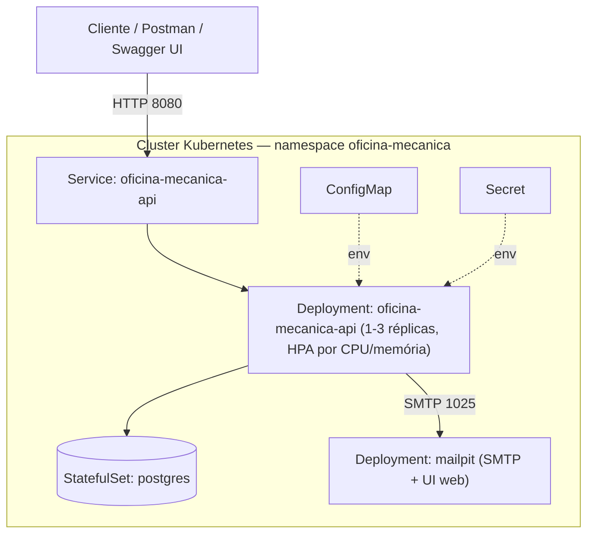
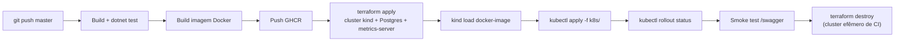

# 🔧 Oficina Mecânica - Sistema Integrado de Atendimento e Execução de Serviços

## Objetivo

Back-end de uma oficina mecânica de médio porte, focado em **gestão de ordens de serviço, clientes, veículos, serviços e peças**, aplicando **Domain-Driven Design (DDD)** com boas práticas de qualidade de software e segurança.

### Fase 2 — Evolução para produção

A Fase 2 evolui a aplicação da Fase 1 para suportar operação em escala, com foco em:
- Fechar lacunas de negócio nas APIs de OS (listagem priorizada por status, notificação de mudança de status por e-mail, endpoints de acompanhamento/aprovação públicos para o cliente final);
- Conteinerização revisada (Docker + docker-compose com Mailpit para e-mail local);
- Orquestração com **Kubernetes** (Deployment, Service, ConfigMap, Secret, HPA);
- Provisionamento de infraestrutura como código com **Terraform** (cluster + banco de dados);
- Pipeline de **CI/CD** completo (build, testes, imagem Docker, deploy no cluster).

## Tecnologias

| Tecnologia | Justificativa |
|---|---|
| **.NET 8** | LTS, alta performance, ecossistema maduro para APIs RESTful |
| **PostgreSQL 16** | Banco relacional robusto, open-source, excelente para dados transacionais de ordens de serviço, controle de estoque e relacionamentos entre clientes/veículos. Escolhido por ser gratuito, ter ótimo suporte a JSON e consultas complexas |
| **Entity Framework Core 8** | ORM produtivo com suporte a migrations e mapeamento rico do domínio |
| **JWT (Bearer Token)** | Autenticação stateless para APIs administrativas |
| **BCrypt** | Hash seguro de senhas |
| **MailKit + Mailpit** | Notificação por e-mail da mudança de status da OS; Mailpit captura os e-mails localmente (sem SMTP real) |
| **xUnit + Moq** | Testes unitários e de integração |
| **Docker / docker-compose** | Containerização para execução local |
| **Kubernetes (kind)** | Orquestração de containers, com HPA para escalabilidade dinâmica |
| **Terraform** | Infraestrutura como código (cluster Kubernetes + banco de dados) |
| **GitHub Actions** | Pipeline de CI/CD |

## Arquitetura

Aplicação em camadas seguindo Clean Architecture / DDD:

```
OficinaMecanica.Domain         → Entidades, Value Objects, Enums (núcleo do domínio)
OficinaMecanica.Application    → Use Cases, DTOs, Interfaces
OficinaMecanica.Infrastructure → Repositórios (EF Core), Serviços, JWT, BCrypt, E-mail (MailKit)
OficinaMecanica.API            → Controllers REST, Program.cs, Swagger
OficinaMecanica.Tests          → Testes unitários (domínio/use cases) e integração
```

### Componentes de infraestrutura (Kubernetes)



- **Terraform** (`/infra`) provisiona o **cluster** (kind local) e o **banco de dados** (Postgres via StatefulSet + PVC + Secret) e instala o `metrics-server`.
- **Manifestos Kubernetes** (`/k8s`) definem a **aplicação**: Deployment/Service/ConfigMap/Secret/HPA da API e do Mailpit.

### Fluxo de deploy (CI/CD)



## Funcionalidades

### Ordem de Serviço (OS)
- Criação com identificação do cliente (CPF/CNPJ), veículo (placa, marca, modelo, ano), serviços e peças, retornando a identificação única da OS
- Orçamento automático (soma de serviços + peças)
- Fluxo de status: **Recebida → Em Diagnóstico → Aguardando Aprovação → Em Execução → Finalizada → Entregue**
- Cancelamento com motivo
- Consulta pública de acompanhamento por número da OS (sem autenticação)
- Aprovação/recusa pública de orçamento (endpoint para notificações externas do cliente)
- Listagem administrativa priorizada: **Em Execução > Aguardando Aprovação > Em Diagnóstico > Recebida**, mais antigas primeiro dentro do mesmo status, excluindo (lógica, não física) OS Finalizadas e Entregues
- Notificação por e-mail ao cliente a cada mudança de status (via Mailpit em ambiente local/Kubernetes)
- Monitoramento de tempo médio de execução

### CRUDs Administrativos (autenticados via JWT)
- Clientes (com validação de CPF/CNPJ)
- Veículos (com validação de placa — formato antigo e Mercosul)
- Serviços
- Peças e Insumos (com controle de estoque — entrada/saída)

### Segurança
- Autenticação JWT para endpoints administrativos
- Endpoints públicos de acompanhamento, aprovação e recusa de orçamento da OS (sem autenticação)
- Senhas armazenadas com BCrypt
- Validação de dados sensíveis (CPF/CNPJ, placa)

## Como Executar

### Pré-requisitos
- [Docker](https://www.docker.com/) e Docker Compose instalados

### Subir o ambiente completo

```bash
docker-compose up -d --build
```

Isso irá iniciar:
- **API** em `http://localhost:5000` (Swagger em `http://localhost:5000/swagger`)
- **PostgreSQL** na porta `5433`
- **Mailpit** (captura os e-mails de notificação de status) — UI web em `http://localhost:8025`

### Executar localmente (sem Docker para a API)

1. Suba apenas o banco:
   ```bash
   docker-compose up -d postgres
   ```

2. Execute a API:
   ```bash
   cd OficinaMecanica.API
   dotnet run
   ```

3. Acesse o Swagger: `https://localhost:{porta}/swagger`

### Executar testes

```bash
dotnet test OficinaMecanica.Tests/OficinaMecanica.Tests.csproj --verbosity normal
```

## Testes e Cobertura de Código

O projeto possui testes automatizados (unitários e de integração), todos passando, organizados em:

| Tipo | Descrição |
|---|---|
| **Unitários — Domínio** | Entidades, Value Objects (CPF/CNPJ, Placa, ItemServico, ItemPeca) |
| **Unitários — Use Cases** | Todos os fluxos de negócio com mocks via Moq |
| **Integração** | Endpoints via `WebApplicationFactory` + banco InMemory |

A cobertura mínima exigida pelo desafio é de **80% nos domínios críticos**, requisito atendido pelo projeto. As Migrations geradas automaticamente pelo EF Core são excluídas da medição via `coverlet.runsettings`.

### Gerar relatório HTML de cobertura

```bash
# 1. Executar testes coletando cobertura
dotnet test OficinaMecanica.Tests/OficinaMecanica.Tests.csproj \
  --settings OficinaMecanica.Tests/coverlet.runsettings \
  --collect:"XPlat Code Coverage" \
  --results-directory ./TestResults/coverage

# 2. Gerar relatório HTML (requer reportgenerator instalado)
dotnet tool install --global dotnet-reportgenerator-globaltool   # apenas na primeira vez

reportgenerator \
  -reports:"TestResults/coverage/**/coverage.cobertura.xml" \
  -targetdir:"TestResults/Report" \
  -reporttypes:"Html"

# 3. Abrir o relatório
start TestResults/Report/index.html   # Windows
open TestResults/Report/index.html    # macOS/Linux
```

## Deploy em Kubernetes

Pré-requisitos: [Docker](https://www.docker.com/), [Terraform](https://developer.hashicorp.com/terraform/install) >= 1.5, [kubectl](https://kubernetes.io/docs/tasks/tools/).

1. Provisione o cluster (kind local) e o banco de dados via Terraform — ver [`/infra`](infra/README.md) para detalhes de todos os recursos criados:
   ```bash
   cd infra
   terraform init
   terraform apply -auto-approve
   export KUBECONFIG=$(terraform output -raw kubeconfig_path)
   ```
2. Aplique os manifestos da aplicação:
   ```bash
   kubectl apply -f k8s/
   kubectl rollout status deployment/oficina-mecanica-api -n oficina-mecanica
   ```
3. Acesse a API:
   ```bash
   kubectl port-forward svc/oficina-mecanica-api 8080:8080 -n oficina-mecanica
   # Swagger em http://localhost:8080/swagger
   ```
4. Para acompanhar o autoscaling (HPA):
   ```bash
   kubectl get hpa -n oficina-mecanica --watch
   ```
5. Para desprovisionar tudo:
   ```bash
   cd infra && terraform destroy -auto-approve
   ```

Manifestos em [`/k8s`](k8s): `configmap.yaml`, `secret.yaml`, `deployment.yaml`, `service.yaml`, `hpa.yaml`, `mailpit-deployment.yaml`, `mailpit-service.yaml`.

## Provisionamento de Infraestrutura (Terraform)

Os scripts em [`/infra`](infra/README.md) provisionam, via Terraform:
- Cluster Kubernetes local (`kind`);
- Namespace `oficina-mecanica`;
- Banco de dados PostgreSQL (Secret + PersistentVolumeClaim + StatefulSet + Service);
- `metrics-server` (pré-requisito do HPA).

Veja [`infra/README.md`](infra/README.md) para a lista completa de recursos e instruções de `apply`/`destroy`.

## CI/CD

Pipeline em [`.github/workflows/ci-cd.yml`](.github/workflows/ci-cd.yml), disparado em push para `master`, executa:
1. Build e testes automatizados (`dotnet test`);
2. Build da imagem Docker e push para o GitHub Container Registry (GHCR);
3. `terraform apply` — cria um cluster kind efêmero, o banco de dados e o `metrics-server` dentro do próprio runner do GitHub Actions;
4. Carrega a imagem no cluster e aplica os manifestos de `/k8s` (`kubectl apply`);
5. Aguarda o rollout dos Deployments e executa um smoke test contra o Swagger;
6. `terraform destroy` — desprovisiona o cluster efêmero ao final.

Isso valida de ponta a ponta, a cada push, que a aplicação builda, passa nos testes, sobe no Kubernetes e fica pronta para receber tráfego.

Há também o workflow [`.github/workflows/build.yml`](.github/workflows/build.yml), com a análise de qualidade/cobertura via SonarQube.

## Collection da API

A especificação completa da API é publicada via Swagger/OpenAPI:
- Swagger UI: `http://localhost:5000/swagger` (local) ou `http://localhost:8080/swagger` (Kubernetes, via `port-forward`);
- Documento OpenAPI (JSON): `/swagger/v1/swagger.json` — pode ser importado diretamente no Postman ou Insomnia (`Import → Link`).

## Estrutura do Repositório

```
├── OficinaMecanica.API/            # Camada de apresentação (Controllers, Program.cs)
│   └── Dockerfile                  # Build da aplicação
├── OficinaMecanica.Application/    # Camada de aplicação (Use Cases, DTOs)
├── OficinaMecanica.Domain/         # Camada de domínio (Entidades, Value Objects)
├── OficinaMecanica.Infrastructure/ # Camada de infraestrutura (EF Core, JWT, BCrypt, E-mail)
├── OficinaMecanica.Tests/          # Testes unitários e de integração
├── k8s/                            # Manifestos Kubernetes (Deployment, Service, ConfigMap, Secret, HPA)
├── infra/                          # Scripts Terraform (cluster + banco de dados)
├── .github/workflows/              # Pipelines de CI/CD e análise SonarQube
├── docker-compose.yml              # Orquestração do ambiente local
└── README.md                       # Este arquivo
```

## Autores

| Nome |
|---|---|
| *Taynan Konrath* |
