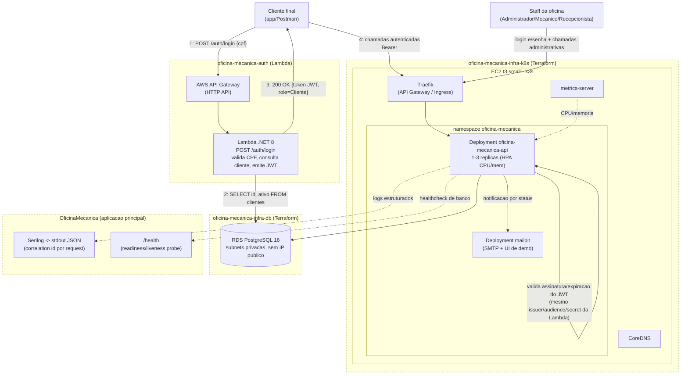

# Diagrama de Componentes — visão de nuvem, APIs, banco e monitoramento

Visão completa dos 4 repositórios e como eles se conectam em produção (AWS, via AWS Academy
Learner Lab). Cada bloco pontilhado é um repositório Git com CI/CD próprio.

## Legenda por repositório

| Repositório | Responsabilidade | Componentes neste diagrama |
|---|---|---|
| [oficina-mecanica-auth](https://github.com/konrath9/oficina-mecanica-auth) | Function Serverless de autenticação via CPF | AWS API Gateway, Lambda |
| [oficina-mecanica-infra-k8s](https://github.com/konrath9/oficina-mecanica-infra-k8s) | Cluster Kubernetes | EC2 (k3s), Traefik, CoreDNS, metrics-server |
| [oficina-mecanica-infra-db](https://github.com/konrath9/oficina-mecanica-infra-db) | Banco de dados gerenciado | RDS PostgreSQL |
| [OficinaMecanica](https://github.com/konrath9/OficinaMecanica) | Aplicação principal + manifestos K8s | Deployment/Service/HPA/Ingress da API e do Mailpit, logs, health check |

## Observabilidade

- **Logs estruturados** (JSON, via Serilog) na saída padrão de cada pod, com `X-Correlation-Id`
  gerado/ecoado pelo `CorrelationIdMiddleware` — permite correlacionar todas as linhas de log de
  uma mesma requisição.
- **`/health`** consultado pelas probes de readiness/liveness do Kubernetes (`k8s/deployment.yaml`)
  e é o endpoint que o pipeline de CI/CD usa como smoke test pós-deploy.
- **`metrics-server`** alimenta o HPA (CPU/memória) — ver [ADR 0004](../adr/0004-uso-de-hpa-para-escalabilidade.md).
