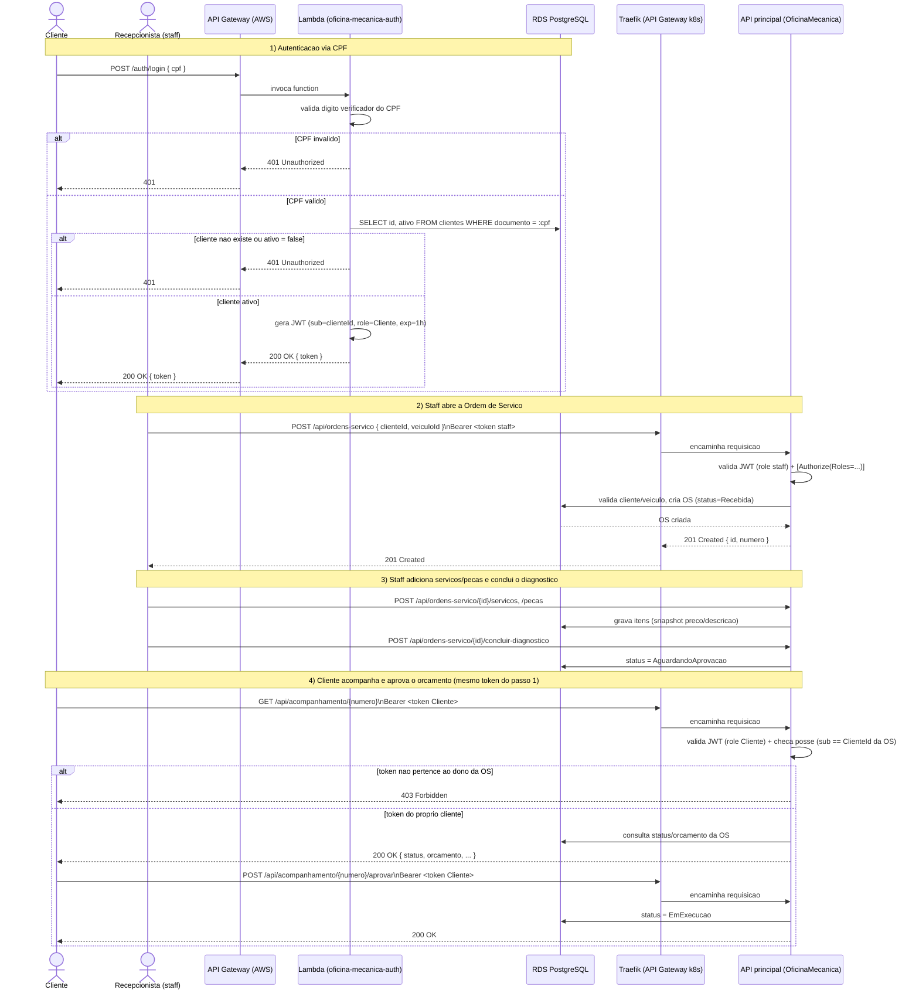

# Diagrama de Sequência — autenticação via CPF e abertura de Ordem de Serviço

Cobre o fluxo pedido pelo desafio: autenticação do cliente por CPF (Function Serverless) e
abertura de uma Ordem de Serviço, incluindo a etapa de acompanhamento/aprovação pelo próprio
cliente autenticado.

## Pontos de decisão relevantes

- O **mesmo JWT** obtido no passo 1 é reutilizado nos passos 4 (acompanhamento/aprovação) — não
  existe um segundo login para o cliente acompanhar a própria OS (ver [RFC 0003](../rfc/0003-estrategia-de-autenticacao.md)).
- A checagem de posse (`sub == ClienteId`) acontece **na API principal**, não no API Gateway —
  o Traefik só roteia; quem decide autorização é a aplicação (ver [ADR 0003](../adr/0003-comunicacao-sincrona-via-rest.md)).
- Um cliente inativo (`ativo = false`) nunca recebe token no passo 1 — a Function Serverless
  nega antes mesmo do JWT ser gerado.
