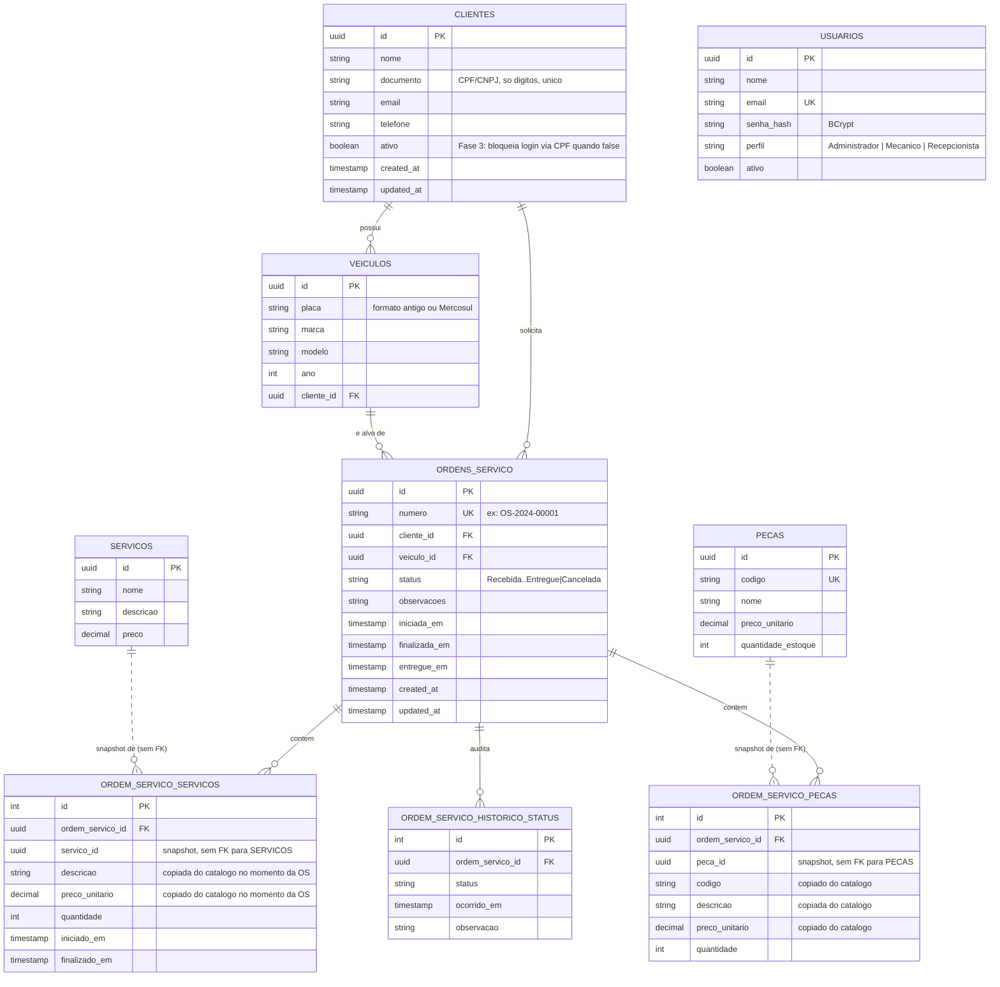

# Modelo de dados — justificativa e diagrama ER

Justificativa formal da escolha do banco está na [RFC 0002](rfc/0002-escolha-do-banco-de-dados.md).
Este documento detalha o **modelo relacional** e os ajustes feitos para a Fase 3.

## Diagrama ER

## Relacionamentos e por que são assim

- **`clientes` 1—N `veiculos`** e **`clientes`/`veiculos` 1—N `ordens_servico`**: um cliente pode
  ter vários veículos e várias OS; uma OS sempre referencia exatamente um cliente e um veículo
  (FK obrigatória, `IsRequired()` nas configurações do EF Core).
- **`ordens_servico` 1—N `ordem_servico_servicos`/`ordem_servico_pecas`/`ordem_servico_historico_status`**:
  modelados como **Owned Types** do EF Core (agregado DDD — `OrdemServico` é a raiz de agregado).
  Isso significa que essas três tabelas só existem em função de uma OS: não têm repositório
  próprio, são carregadas/salvas sempre junto com a OS dona, garantindo que o agregado inteiro
  seja consistente numa única transação.
- **`ordem_servico_servicos`/`ordem_servico_pecas` guardam uma cópia do preço e da descrição do
  catálogo, sem FK real para `servicos`/`pecas`** (só um `Guid` solto, sem `.HasForeignKey()` no
  EF Core apontando pra essas tabelas). Essa é a decisão de modelagem mais importante desta
  camada, e existe por um motivo de negócio: **o valor de uma OS não pode mudar retroativamente**
  se o preço de um serviço/peça for reajustado depois. Sem o snapshot, um reajuste de preço no
  catálogo alteraria o orçamento de OS já fechadas/aprovadas — inaceitável para uma cobrança já
  comunicada ao cliente. O soft-reference ao id original (`servico_id`/`peca_id`) é mantido só
  para rastreabilidade (saber qual item do catálogo originou aquele item da OS), não para
  recalcular valores.
- **`usuarios` é independente** das demais tabelas (staff da oficina) — não tem FK de/para
  `clientes`, porque representa uma pessoa da equipe, não um cliente.
- **`clientes.ativo`** (adicionado nesta fase, migration `AddClienteAtivo`): único ajuste de
  schema motivado diretamente pela Fase 3 — a Function Serverless de login via CPF precisa negar
  autenticação para clientes desativados, e antes não havia esse conceito de status no cliente.

## Índices relevantes

- `ix_clientes_documento` (único) — impede duplicidade de CPF/CNPJ, e é a coluna usada pela
  Function Serverless na busca por CPF (`regexp_replace(documento, ...)`).
- `ix_ordens_servico_numero` (único), `ix_ordens_servico_cliente_id`, `ix_ordens_servico_veiculo_id`,
  `ix_ordens_servico_status`, `ix_ordens_servico_criada_em` — suportam as consultas mais comuns:
  busca por número (acompanhamento), listagem por cliente/veículo, filtro por status (listagem
  administrativa priorizada) e por data (relatório de tempo médio de execução, volume diário —
  ver requisito de dashboards no README).
